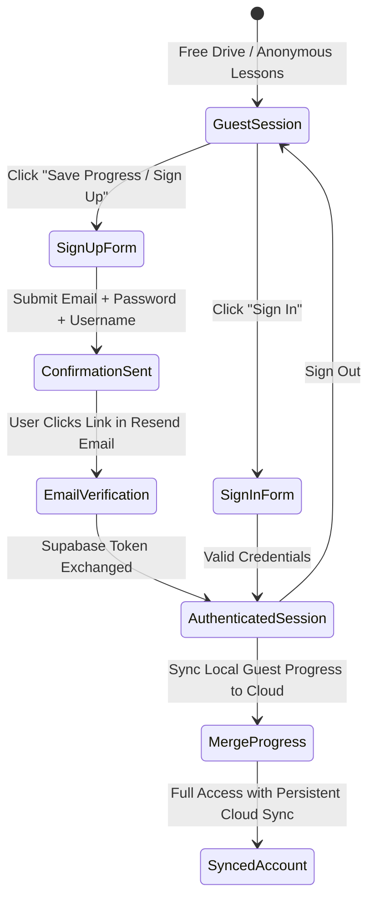

# Supabase Auth & Account-Based Progress Synchronization Architecture
**Manual Driving Trainer — Authentication & Persistence Specification**

---

## 1. Overview & Objectives

This document outlines the architecture, database migrations, security policies, and UI integration for user authentication and account-based progress persistence in the Manual Driving Trainer.

### Core Goals:
1. **Supabase Auth with Email & Password**:
   - Secure sign-up, registration, and sign-in using `@supabase/supabase-js`.
   - Transactional email confirmation and password reset via **Resend SMTP**.
2. **Account-Bound Driving Progress**:
   - Each registered user has an isolated, persistent record of lesson stars, smoothness scores, stall counts, best times, and driving trip history.
3. **Seamless Guest-to-Account Migration**:
   - Users can start playing as a guest immediately without friction.
   - Upon signing up or logging in, their local guest progress is merged into their remote account without losing achievements.
4. **Cockpit Account Navigation**:
   - Clean, lightweight profile widget in the dashboard header displaying user status, session sync indicator, and quick logout.

---

## 2. Authentication Flow & Resend Integration

### 2.1 Resend SMTP Configuration (Supabase Dashboard)
Resend will be used as the custom SMTP provider for Supabase Auth transactional emails (confirmations, password recovery, magic links).

In the **Supabase Dashboard** (`Settings` $\rightarrow$ `Authentication` $\rightarrow$ `SMTP Settings`):
- **Enable Custom SMTP**: `ON`
- **Sender Email**: Verified email on Resend (e.g. `auth@yourdomain.com` or `onboarding@resend.dev`)
- **Sender Name**: `Manual Driving Trainer`
- **Host**: `smtp.resend.com`
- **Port**: `465` (SSL) or `587` (TLS)
- **Username**: `resend`
- **Password**: User's Resend API Key (`re_...`)
- **Redirect URLs**:
  - `http://localhost:3000/auth/callback`
  - `https://your-vercel-domain.vercel.app/auth/callback`

### 2.2 Auth Lifecycle State Machine



---

## 3. Database Schema & Migration Specification

A new migration `supabase/migrations/20261002_auth_integration.sql` will be applied via `npx supabase db push`.

### 3.1 Automatic Profile Creation Trigger
Whenever a user signs up via `auth.users`, a database trigger will automatically populate `public.profiles`:

```sql
-- Function to handle new user registration from Supabase Auth
CREATE OR REPLACE FUNCTION public.handle_new_user()
RETURNS trigger AS $$
BEGIN
  INSERT INTO public.profiles (id, username, created_at, preferences)
  VALUES (
    new.id,
    COALESCE(new.raw_user_meta_data->>'username', split_part(new.email, '@', 1)),
    now(),
    '{}'::jsonb
  )
  ON CONFLICT (id) DO NOTHING;
  RETURN new;
END;
$$ LANGUAGE plpgsql SECURITY DEFINER;

-- Trigger firing on auth.users creation
DROP TRIGGER IF EXISTS on_auth_user_created ON auth.users;
CREATE TRIGGER on_auth_user_created
  AFTER INSERT ON auth.users
  FOR EACH ROW EXECUTE FUNCTION public.handle_new_user();
```

### 3.2 Foreign Key & Index Alignment
- `public.profiles.id` $\rightarrow$ `REFERENCES auth.users(id) ON DELETE CASCADE`.
- `public.driving_sessions.user_id` $\rightarrow$ `REFERENCES auth.users(id) ON DELETE CASCADE`.
- `public.lesson_progress.user_id` $\rightarrow$ `REFERENCES auth.users(id) ON DELETE CASCADE`.

### 3.3 Hardened Row Level Security (RLS) Policies

| Table | Operation | Policy Condition | Description |
| :--- | :--- | :--- | :--- |
| `profiles` | `SELECT` | `true` | Public read access for usernames / leaderboards |
| `profiles` | `UPDATE` | `auth.uid() = id` | Users can only modify their own profile and preferences |
| `driving_sessions` | `SELECT` | `auth.uid() = user_id OR user_id IS NULL` | Users see their own sessions; guests see anon |
| `driving_sessions` | `INSERT` | `auth.uid() = user_id OR auth.uid() IS NULL` | Allow inserting authenticated or guest sessions |
| `lesson_progress` | `SELECT` | `auth.uid() = user_id OR user_id IS NULL` | Users see their own lesson records |
| `lesson_progress` | `INSERT` | `auth.uid() = user_id OR auth.uid() IS NULL` | Allow upserting user or guest progress |
| `lesson_progress` | `UPDATE` | `auth.uid() = user_id OR auth.uid() IS NULL` | Allow updating user or guest progress |

---

## 4. Client-Side Architecture

### 4.1 `stores/authStore.ts` (Zustand)
Manages the active Supabase session and user state:

```ts
export interface UserProfile {
  id: string;
  email?: string;
  username: string;
  createdAt: string;
  preferences: Record<string, unknown>;
}

export interface AuthState {
  user: User | null;
  profile: UserProfile | null;
  session: Session | null;
  isLoading: boolean;
  isAuthenticated: boolean;
  initAuth: () => Promise<void>;
  signUp: (email: string, password: string, username: string) => Promise<{ error: Error | null }>;
  signIn: (email: string, password: string) => Promise<{ error: Error | null }>;
  signOut: () => Promise<void>;
  mergeGuestProgress: () => Promise<void>;
}
```

### 4.2 Guest Progress Merge Algorithm
When transitioning from guest to authenticated user:
1. Read all local lesson records from `localStorage.getItem('manual_sim_lesson_progress')`.
2. Fetch existing cloud progress for `user.id` from `public.lesson_progress`.
3. For each lesson:
   $$\text{stars}_{\text{merged}} = \max(\text{stars}_{\text{local}}, \text{stars}_{\text{cloud}})$$
   $$\text{smoothness}_{\text{merged}} = \max(\text{smoothness}_{\text{local}}, \text{smoothness}_{\text{cloud}})$$
   $$\text{bestTime}_{\text{merged}} = \min(\text{bestTime}_{\text{local}}, \text{bestTime}_{\text{cloud}})$$
4. Upsert merged records to `public.lesson_progress`.
5. Sync updated store and notify user with a toast: *"🎉 Guest progress successfully merged into your account!"*.

---

## 5. UI & Route Architecture

### 5.1 Route Structure
- `app/auth/login/page.tsx`: Sign In with email/password, "Remember Me", link to Register and Forgot Password.
- `app/auth/register/page.tsx`: Sign Up with username, email, password, password strength meter, terms agreement.
- `app/auth/callback/route.ts`: Next.js Route Handler for handling email confirmation tokens from Supabase/Resend and redirecting back to `/lessons` or `/simulator`.
- `app/auth/forgot-password/page.tsx`: Request password reset email.

### 5.2 Header Profile Integration
In `components/dashboard/CockpitHeader.tsx` and top bar of `app/map/page.tsx`:
- When **Guest**:
  - Show sleek `[👤 Sign In / Register]` pill with a subtle pulse badge: *"Guest Mode (Progress saved locally)"*.
- When **Logged In**:
  - Show avatar pill with user's initial or username: `[🟢 JohnDoe ▼]`.
  - Dropdown menu:
    - View Progress (`/progress`)
    - Driving Lessons (`/lessons`)
    - Cloud Sync Status (`🟢 Synced to Cloud`)
    - Sign Out button

---

## 6. Implementation Milestones

- [ ] **Milestone 1**: Author database migration `supabase/migrations/20261002120000_auth_profiles.sql` and run `npx supabase db push`.
- [ ] **Milestone 2**: Implement `stores/authStore.ts` with real-time `onAuthStateChange` subscription and guest progress merging.
- [ ] **Milestone 3**: Create `app/auth/callback/route.ts` and auth pages (`/auth/login`, `/auth/register`).
- [ ] **Milestone 4**: Wire header avatar and sync indicators in `CockpitHeader.tsx` and `app/map/page.tsx`.
- [ ] **Milestone 5**: Verify complete sign up, email confirmation redirect, login, and progress persistence.
