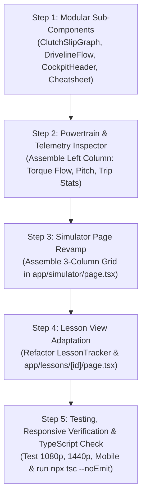

# Frontend Revamp & Widescreen Cockpit Architecture Proposal
**Manual Driving Trainer**
**Document Version:** 1.0.0  
**Target:** 3-Column Ergonomic Cockpit for High-Resolution & Widescreen Displays (1080p, 1440p, 4K, Ultrawide)

---

## 1. Executive Summary

The **Manual Driving Trainer** currently confines its user interface to a centered, vertically stacked container constrained by `max-w-5xl` (1024px width). On standard 1080p (1920px), 1440p (2560px), and ultrawide (3440px) displays, between **46% and 70% of horizontal screen real estate sits completely idle as blank dark margins**. Concurrently, critical telemetry, instrument dials, pedal bars, and pedagogical instructions stack vertically, forcing continuous scrolling during real-time driving maneuvers. Learners are unable to simultaneously monitor pedal travel, tachometer needle movement, clutch bite point slip, and lesson objectives within a single unified viewport.

This proposal outlines a comprehensive revamp transforming the application into a **Pro-Grade 3-Column Widescreen Cockpit Architecture** (`max-w-[1800px]` fluid layout). The design maximizes horizontal visibility, eliminates viewport scrolling, exposes live driveline torque flow physics, renders real-time dual-trace clutch/input-shaft synchronization graphs, and keeps the instructional feedback loop in permanent view.

---

## 2. Analysis of Current Limitations

### 2.1 Screen Real Estate & Layout Bottlenecks
* **`max-w-5xl` Hard Ceiling**: Both [`app/simulator/page.tsx`](file:///home/orven/Documents/manual-transmission-sim/app/simulator/page.tsx#L25) and [`components/dashboard/Dashboard.tsx`](file:///home/orven/Documents/manual-transmission-sim/components/dashboard/Dashboard.tsx#L24) restrict content to a maximum width of 1024px.
  - **1080p (1920×1080)**: ~896px of dead margin space (~47% wasted width).
  - **1440p (2560×1440)**: ~1536px of dead margin space (~60% wasted width).
  - **Ultrawide (3440×1440)**: ~2416px of dead margin space (~70% wasted width).
* **Vertical Stacking & Viewport Overflow**:
  1. Top navigation header (~80px)
  2. Road gradient selector banner (~60px)
  3. Instructor HUD banner (~60px)
  4. Analog gauge binnacle (~340px)
  5. Vertical pedal cluster & steering indicator (~280px)
  6. Keyboard controls cheatsheet (~140px)
  *Total content height exceeds 960px* before outer margins. On standard 1080p displays with browser chrome (~940px usable height), the pedal cluster or cheatsheet is pushed below the fold.
* **Curriculum Friction in Lesson View (`/lessons/[id]`)**:
  In [`app/lessons/[id]/page.tsx`](file:///home/orven/Documents/manual-transmission-sim/app/lessons/%5Bid%5D/page.tsx#L129), the [`LessonTracker`](file:///home/orven/Documents/manual-transmission-sim/components/instructor/LessonTracker.tsx) card adds another ~220px of vertical height directly above the instrument cluster. Learners practicing delicate maneuvers (e.g. Lesson 2: Finding the Friction Zone or Lesson 4: Hill Starts) must constantly scroll between the objective instructions and the clutch pedal travel gauge.

### 2.2 Hidden Telemetry & Pedagogical Deficits
* **Concealed Driveline Physics**: The simulation engine calculates high-fidelity internal states (engine net torque, clutch slip torque, slip speed $\Delta \omega$, transmission gear ratio multiplication, and wheel tractive torque). These values are currently hidden in code or rendered only as scalar text, depriving learners of visual intuition for how torque flows through a manual powertrain.
* **Absence of Rev-Matching Visualization**: The clutch slip state [`clutch.slipSpeed`](file:///home/orven/Documents/manual-transmission-sim/lib/simulation/types.ts#L73) and the difference between Flywheel RPM and Transmission Input Shaft RPM are primary indicators of smooth shifting and heel-toe downshifting. Currently, there is no real-time waveform or synchronization graph showing these two rotational speeds converging during clutch engagement.

---

## 3. Proposed Widescreen Cockpit Architecture (3-Column Layout)

The new interface utilizes a balanced 3-column CSS Grid responsive architecture bounded by `max-w-[1800px]` with fluid padding (`px-4 sm:px-6 lg:px-8`).

```
┌──────────────────────────────────────────────────────────────────────────────────────────────────┐
│ TOP BAR: Modern Automotive Header (Brand, Mode, Session Timer, Audio, Pause ESC, Reset, Nav)    │
├───────────────────────────────┬──────────────────────────────────┬───────────────────────────────┤
│ LEFT COLUMN (3 cols / ~25%)   │ CENTER COLUMN (6 cols / ~50%)    │ RIGHT COLUMN (3 cols / ~25%)  │
│ Powertrain & Telemetry        │ Primary Automotive Instrument    │ Real-Time Clutch & RPM Graph  │
│ Inspector                     │ Cluster                          │ & Environment Controls        │
│                               │                                  │                               │
│ • Live Driveline Torque Flow  │ • Driving Instructor HUD Banner  │ • Flywheel RPM vs Input Shaft │
│   - Flywheel Torque (Nm)      │ • Analog Binnacle:               │   RPM Dual-Trace Waveform     │
│   - Clutch Slip & Clamp State │   - Speedometer (0-220 km/h)     │ • Hermite Friction Zone       │
│   - Gear Ratio Multiplication │   - Central Gear & Tell-Tales    │   Engagement Gauge (40%-65%)  │
│   - Wheel Torque & Traction   │   - Tachometer (0-8000 RPM)      │ • Road Gradient Selector      │
│ • Incline & Pitch Attitude    │ • Vertical Pedal Cluster:        │   (Flat 0%, Hill 6%, 12%)     │
│ • Session Trip Telemetry      │   - Clutch, Brake, Throttle      │ • Compact Controls            │
│   (Odo, Top Speed, Stalls)    │   - Steering Angle Arc           │   Cheatsheet Cards            │
└───────────────────────────────┴──────────────────────────────────┴───────────────────────────────┘
```

### 3.1 Responsive Breakpoint Matrix

| Viewport Range | Grid Architecture | Layout Behavior |
| :--- | :--- | :--- |
| **Widescreen / Desktop** (`≥ 1280px` / `xl`, `2xl`) | `grid grid-cols-12 gap-6` | **3-Column Cockpit**: Left (3 cols), Center (6 cols), Right (3 cols). Zero vertical scrolling on 1080p and 1440p displays. |
| **Laptop / Medium** (`1024px - 1279px` / `lg`) | `grid grid-cols-12 gap-6` | **Asymmetric 2-Column**: Center Instrument Cluster (7 cols), Telemetry & Controls (5 cols tabbed or stacked). |
| **Tablet / Mobile** (`< 1024px` / `md`, `sm`) | `flex flex-col gap-6` | **Stacked Single Column**: Primary Instrument Cluster prioritized at top; collapsible drawer/tabs for Powertrain Inspector and RPM Waveform. |

---

### 3.2 Detailed Column Specifications

#### Column 1: Left — Powertrain & Telemetry Inspector (`3 cols`)
Dedicated to mechanical transparency and vehicle longitudinal dynamics:
1. **Live Driveline Torque Flow Diagram**:
   - Visual mechanical chain showing sequential energy transfer:
     $$\text{Engine Flywheel } (T_e, \text{RPM}) \xrightarrow{\quad} \text{Clutch Disc } (T_{\text{slip}}, \Delta\omega) \xrightarrow{\quad} \text{Transmission Gear } (i_g) \xrightarrow{\quad} \text{Drive Wheels } (T_w, v)$$
   - Color-coded coupling states:
     * **Locked/Coupled** (Emerald): Flywheel and input shaft locked, 100% torque transmission.
     * **Slipping/Friction** (Amber/Cyan): Kinetic friction active, dynamic torque transfer proportional to Hermite engagement curve.
     * **Disengaged/Open** (Slate): No torque transfer, input shaft freewheeling.
2. **Pitch & Incline Attitude Graphic**:
   - Graphical vehicle chassis silhouette tilting dynamically with road grade ($\theta$).
   - Grade percentage readout (`0%`, `6%`, `12%`).
   - Gravity rollback vector indicator ($\vec{F}_{\text{gravity}} = m \cdot g \cdot \sin\theta$) alerting learners to uphill rollback hazard when brakes and clutch are released.
3. **Session Trip Telemetry**:
   - Cumulative session distance (meters/kilometers).
   - Session elapsed driving time.
   - Peak velocity achieved.
   - Stall counter and smooth launch counter.

#### Column 2: Center — Primary Automotive Instrument Cluster (`6 cols`)
Dedicated to the primary driving controls and immediate instrumentation:
1. **Rule-Based Instructor HUD Banner**:
   - Integrated atop the instrument binnacle, displaying immediate real-time feedback (e.g. *"Smooth clutch release - biting point reached"*, *"Lugging! Downshift or depress clutch"*, *"Engine stalled - depress clutch and hold I"*).
2. **Primary Analog Instrument Binnacle**:
   - **Speedometer** (Left dial): Smooth SVG needle, digital numeric readout, speed units (km/h), rollback indicator.
   - **Status & Tell-Tales HUD** (Center): High-visibility gear indicator badge (`R`, `N`, `1`–`5`), starter crank active indicator, parking brake status lamp (`(P)` red indicator), engine status badge (`RUNNING`, `OFF`, `STALLED`), and lugging warning.
   - **Tachometer** (Right dial): High-precision dial with illuminated redline zone (6,500–8,000 RPM), lugging zone (<900 RPM under load), and needle smoothing.
3. **Ergonomic Vertical Pedal Cluster & Steering**:
   - Three full-height vertical pedal bars: **Clutch** (amber), **Foot Brake** (rose), **Throttle** (emerald).
   - **Highlighted Friction / Bite Point Zone**: Clearly marked bracket on clutch pedal between **40% and 65% travel**, indicating exactly where friction plates engage.
   - **Steering Angle Arc**: Centered horizontal gauge displaying current wheel angle and centering spring tension.

#### Column 3: Right — Real-Time Clutch & Rev-Matching Telemetry Graph (`3 cols`)
Dedicated to clutch technique mastery, rev-matching, and environment management:
1. **Real-Time Dual-Trace Waveform Graph (`ClutchSlipGraph.tsx`)**:
   - High-performance, lightweight HTML5 `<canvas>` rendering 60 FPS rolling 4-second telemetry window:
     * **Gold Trace**: Flywheel RPM ($\omega_e$)
     * **Cyan Trace**: Transmission Input Shaft RPM ($\omega_t = \omega_{\text{wheel}} \cdot i_{\text{gear}} \cdot i_{\text{final}}$)
   - When the clutch is released smoothly, learners visually see the cyan line rise or fall to merge seamlessly with the gold line.
   - Slip speed delta $\Delta \text{RPM} = |\text{Flywheel} - \text{Input Shaft}|$ displayed with color thresholding (Emerald = synchronized $\le 50\text{ RPM}$, Amber = slipping, Rose = extreme mismatch).
2. **Hermite Friction Engagement Indicator**:
   - Horizontal bar showing theoretical clamping force ($k_{\text{clutch}} \in [0.0, 1.0]$) calculated via smoothstep Hermite polynomial vs raw pedal position.
3. **Road Gradient Quick-Selector**:
   - Clean, tactile button cluster for instantaneous slope adjustment: **Flat (0%)**, **Gentle Hill (6%)**, **Steep Hill (12%)**.
4. **Compact Controls Quick-Reference**:
   - Modular, condensed keyboard badge cluster detailing W/S/A/D, Space (Clutch), E/Q (Gears), N (Neutral), R (Reverse), P (Handbrake), I (Starter), and ESC (Pause).

---

### 3.3 Top Bar: Modern Automotive Header

Replaces the current generic header with a cockpit-grade status and management bar:
* **Brand & Mode Identity**: Title, live status pulsing indicator (Green = active, Amber = paused, Rose = stalled).
* **Live Session Stopwatch**: High-precision timer (`MM:SS`) tracking continuous driving time.
* **Audio Quick-Toggle**: Volume/Mute button with stateful acoustic waves indicator and click-to-resume audio unlock handling.
* **Simulation Controls**:
  - Pause / Resume toggle button with `[ESC]` shortcut badge.
  - Vehicle Reset button with rapid confirmation.
* **Navigation Link**: Contextual back-links (Home or Curriculum).

---

## 4. Adaptations for Guided Lesson View (`/lessons/[id]`)

In guided lessons, pedagogical context is paramount. The 3-column architecture adapts seamlessly without squeezing dials or inducing vertical scrolling:

```
┌──────────────────────────────────────────────────────────────────────────────────────────────────┐
│ TOP BAR: Lesson Header (Module ID, Back to Curriculum, Timer, Audio, Pause, Reset Lesson)        │
├──────────────────────────────────────────────────────────────────────────────────────────────────┤
│ LESSON OBJECTIVE HUD BAR: Prominent full-width progress tracker & active objective criteria     │
├───────────────────────────────┬──────────────────────────────────┬───────────────────────────────┤
│ LEFT COLUMN (3 cols)          │ CENTER COLUMN (6 cols)           │ RIGHT COLUMN (3 cols)         │
│ Telemetry & Step Validation   │ Primary Automotive Cluster       │ Live Friction & RPM Graph     │
│ • Step Criteria Checklist     │ • Instructor Feedback HUD        │ • Flywheel vs Input RPM Graph │
│ • Powertrain Torque Flow      │ • Analog Binnacle                │ • Clutch Bite Point Zone Bar  │
│ • Incline & Rollback Telemetry│ • Pedals with Bite Zone Indicator│ • Lesson Controls Reference   │
└───────────────────────────────┴──────────────────────────────────┴───────────────────────────────┘
```

### Key Lesson View Integrations:
1. **Full-Width Panoramic Objective HUD**: [`LessonTracker`](file:///home/orven/Documents/manual-transmission-sim/components/instructor/LessonTracker.tsx) is streamlined into an ergonomic upper HUD bar spanning the top of the grid. It clearly articulates the active objective, step completion hold timer bar, and overall module progress.
2. **Left Column Step Criteria Checklist**: Displays specific parameter pass/fail pills in real time (e.g. `Gear: 1 [OK]`, `Clutch: 45%-60% [HOLDING 1.8s/2.0s]`, `Throttle: 15%-25% [OK]`, `Rollback: 0.0m [PASS]`).
3. **Right Column RPM Synchronization Feedback**: In shifting and rev-matching lessons (e.g. Lesson 3 and Lesson 5), the dual-trace graph provides instant visual verification when the student matches engine speed to wheel speed before releasing the clutch.

---

## 5. Component Breakdown & Refactor Plan

### 5.1 Existing Components to Refactor

| Component File | Refactor Scope & Plan |
| :--- | :--- |
| [`app/simulator/page.tsx`](file:///home/orven/Documents/manual-transmission-sim/app/simulator/page.tsx) | • Remove `max-w-5xl` constraint; replace with `w-full max-w-[1800px] mx-auto px-4 lg:px-8`.<br>• Replace vertically stacked layout with the 3-column responsive grid.<br>• Move gradient selector into the right column.<br>• Move cheatsheet into the right column modular card.<br>• Integrate top-bar automotive header. |
| [`components/dashboard/Dashboard.tsx`](file:///home/orven/Documents/manual-transmission-sim/components/dashboard/Dashboard.tsx) | • Remove inner `max-w-5xl` wrapper.<br>• Provide modular export or flexible props allowing center cluster (Gauges + Pedals) to function standalone inside column 2 or as a full layout. |
| [`app/lessons/[id]/page.tsx`](file:///home/orven/Documents/manual-transmission-sim/app/lessons/%5Bid%5D/page.tsx) | • Transition to widescreen 3-column grid container (`max-w-[1800px]`).<br>• Position redesigned `LessonTracker` as a streamlined horizontal header card above the 3-column cockpit.<br>• Pass lesson objective telemetry criteria into the Left Column Inspector. |
| [`components/instructor/LessonTracker.tsx`](file:///home/orven/Documents/manual-transmission-sim/components/instructor/LessonTracker.tsx) | • Refactor styling to be more compact vertically (`py-3 sm:py-4`) with horizontal flex layout.<br>• Maintain full responsiveness and high-contrast step progression indicators. |
| [`components/dashboard/PedalCluster.tsx`](file:///home/orven/Documents/manual-transmission-sim/components/dashboard/PedalCluster.tsx) | • Retain high-precision vertical travel bars while polishing the 40%-65% Bite Zone visual highlight for maximum clarity at varying display heights. |

---

### 5.2 New Components to Create

```
components/dashboard/
├── CockpitHeader.tsx           <-- Modular automotive top bar (Timer, Audio, Pause, Reset, Nav)
├── PowertrainInspector.tsx     <-- Left column driveline torque flow, pitch attitude, trip stats
├── DrivelineFlow.tsx           <-- Interactive torque transfer block diagram (Flywheel -> Clutch -> Trans -> Wheels)
├── ClutchSlipGraph.tsx         <-- Right column 60fps HTML5 Canvas Flywheel vs Input Shaft RPM graph
├── RoadGradientSelector.tsx    <-- Tactical 0% / 6% / 12% grade selector card
└── ControlsCheatsheet.tsx      <-- Compact modular keyboard control reference
```

#### Detailed Specification of New Components:

1. **`CockpitHeader.tsx`**:
   - Props: `title: string`, `subtitle?: string`, `isPaused: boolean`, `isMuted: boolean`, `onTogglePause: () => void`, `onToggleMute: () => void`, `onReset: () => void`, `backHref?: string`, `backLabel?: string`.
   - Embeds active session stopwatch with continuous elapsed time counter.

2. **`PowertrainInspector.tsx` & `DrivelineFlow.tsx`**:
   - Props: `vehicleState: VehicleState`.
   - Strictly reads precomputed physics properties from `vehicleState`:
     * `engine.netTorque` (Nm) & `engine.angularVelocity`
     * `clutch.slipTorque` (Nm), `clutch.isLocked`, `clutch.engagement`, `clutch.slipSpeed`
     * `transmission.currentGear`, `transmission.gearRatio`, `transmission.wheelTorque`
     * `dynamics.speedKmh`, `dynamics.acceleration`, `dynamics.grade`, `dynamics.distanceTraveled`
   - Zero internal physics or integration calculations—strictly presents visual representations of existing simulation snapshot data.

3. **`ClutchSlipGraph.tsx`**:
   - Props: `rpm: number`, `inputShaftRpm: number`, `clutchEngagement: number`, `isLocked: boolean`.
   - Lightweight `requestAnimationFrame` circular buffer tracking the trailing 240 samples (~4 seconds).
   - Renders dual glowing lines (Flywheel = amber `#f59e0b`, Input Shaft = cyan `#06b6d4`).
   - Includes real-time $\Delta \text{RPM}$ readout and Hermite engagement bar.

4. **`RoadGradientSelector.tsx`**:
   - Props: `currentGrade: number`, `onSelectGrade: (pct: number) => void`.
   - Clean, tactile button pills with active color states (Flat = Emerald, 6% = Amber, 12% = Red).

5. **`ControlsCheatsheet.tsx`**:
   - Compact 2-column or 3-column badge layout with high-contrast keys and labels.

---

## 6. Strict Architectural Boundaries

In strict compliance with project architecture:
1. **Zero Physics in React Components**:
   - Components, hooks, and Zustand stores will **never** calculate vehicle physics, acceleration, engine torque curves, clutch friction curves, or RPM integration.
   - All components are pure visual consumers of [`VehicleState`](file:///home/orven/Documents/manual-transmission-sim/lib/simulation/types.ts#L94) emitted by [`Simulation.tick()`](file:///home/orven/Documents/manual-transmission-sim/lib/simulation/simulation.ts).
2. **Professional Instrument Aesthetic**:
   - Avoid arcade-style gaming HUDs. Maintain a cohesive, technical cockpit aesthetic using Slate/Zinc neutrals, high-contrast indicators, and subdued warning lights (Amber/Emerald/Rose).
3. **TypeScript Compilation Integrity**:
   - All code additions and modifications must compile cleanly under `npx tsc --noEmit` with zero errors.

---

## 7. Step-by-Step Implementation Roadmap



### Phase 1: Modular Sub-Components Construction
* Build `components/dashboard/CockpitHeader.tsx` to standardize the top bar across simulator and lesson views.
* Build `components/dashboard/ClutchSlipGraph.tsx` with high-performance Canvas rendering of Flywheel vs Input Shaft RPM.
* Build `components/dashboard/DrivelineFlow.tsx` displaying the mechanical torque transfer stages.
* Build `components/dashboard/RoadGradientSelector.tsx` and `components/dashboard/ControlsCheatsheet.tsx`.

### Phase 2: Powertrain & Telemetry Inspector Assembly
* Build `components/dashboard/PowertrainInspector.tsx` combining `DrivelineFlow`, pitch/attitude graphic, and trip odometer telemetry into the unified Left Column.

### Phase 3: Simulator Page Revamp (`app/simulator/page.tsx`)
* Refactor [`app/simulator/page.tsx`](file:///home/orven/Documents/manual-transmission-sim/app/simulator/page.tsx) to mount the `CockpitHeader` and the 3-column grid (`max-w-[1800px]`):
  - Left: `PowertrainInspector`
  - Center: `Dashboard` (Center cluster: Gauges + Tell-Tales + Pedals + Instructor Banner)
  - Right: `ClutchSlipGraph`, `RoadGradientSelector`, and `ControlsCheatsheet`

### Phase 4: Lesson View Adaptation (`app/lessons/[id]/page.tsx`)
* Adapt [`app/lessons/[id]/page.tsx`](file:///home/orven/Documents/manual-transmission-sim/app/lessons/%5Bid%5D/page.tsx) to use the 3-column architecture.
* Streamline [`components/instructor/LessonTracker.tsx`](file:///home/orven/Documents/manual-transmission-sim/components/instructor/LessonTracker.tsx) into a compact panoramic objective bar.
* In the Left Column, display the active step's parameter checklist alongside live powertrain telemetry.

### Phase 5: Verification, Responsive Styling & TypeScript Compilation
* Verify responsive breakpoints across 768px, 1024px, 1280px, 1440px, and 1920px viewports.
* Verify 60 FPS rendering performance of the Canvas graph without memory leaks or frame drops.
* Run `npx tsc --noEmit` to ensure complete TypeScript type safety.
