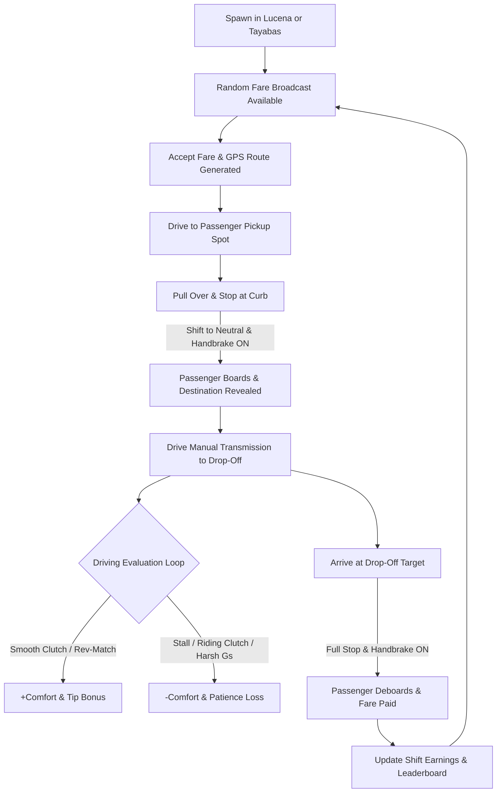

# Taxi Simulation Mode: Lucena City & Tayabas City Corridor
**Manual Driving Trainer — Game Mode & Architectural Specification**

---

## 1. Executive Summary & Feasibility

### Is this mode doable?
**Yes, 100% doable and perfectly aligned with our architecture.**

We already have:
1. **120Hz Manual Powertrain Physics**: Complete ICE engine, Hermite clutch bite point, stalling, and gear gating.
2. **2D Orthogonal OpenStreetMap Canvas**: Leaflet engine with heading-up camera follow, top-down car sprite, and coordinate tracking.
3. **Spatial Vector Road Network**: Pre-bundled Lucena vector corridors and point-to-segment projection.
4. **Supabase Database Persistence**: Real-time progress saving, profiles, and driving session statistics.

By expanding the road corridor northwards to include **Tayabas City** (connected via the 9 km Lucena–Tayabas Road), we create an authentic regional manual taxi/commuter simulation with real-world stakes: **passengers judge your clutch work, shifting smoothness, and stalling in real time**.

---

## 2. Core Gameplay Loop



---

## 3. Geographic Scope: Lucena City & Tayabas City

The simulation is strictly bounded to the contiguous urban and inter-city road network between **Lucena City** and **Tayabas City**, Quezon Province, Philippines:

- **Bounding Box**:
  - South (Lucena Port / Cotta): `13.9100° N`
  - North (Tayabas City Center & Malagonlong): `14.0450° N`
  - West (Diversion / Maharlika Bypass): `121.5700° E`
  - East (Dalahican Access & Quezon Ave): `121.6500° E`
- **Inter-City Artery**: **Lucena–Tayabas Road (Route 607)** — an 8.5 km scenic drive connecting the two cities with natural elevation changes ideal for hill starts and gear selection practice.

### Curated Landmark Points of Interest (POIs)

#### Lucena City POIs (Pickup & Drop-off Hubs)
1. **Quezon Provincial Capitol & Perez Park** (`13.9355, 121.6145`) — Government & heritage district.
2. **Lucena Grand Central Terminal** (`13.9575, 121.5975`) — Main transit hub with high passenger spawn rate.
3. **SM City Lucena** (`13.9378, 121.6022`) — Busy commercial mall with curbside taxi queues.
4. **Sacred Heart College / Merchan St** (`13.9308, 121.6138`) — University campus street.
5. **Manuel S. Enverga University Foundation (MSEUF)** (`13.9452, 121.6212`) — Major university campus.
6. **Pacific Mall Lucena / Quezon Ave** (`13.9348, 121.6185`) — Downtown market hub.
7. **Quezon Medical Center (QMC)** (`13.9385, 121.6130`) — Hospital urgent passenger zone.
8. **Lucena Cotta / Dalahican Port** (`13.9180, 121.6280`) — Ferry passenger terminal.

#### Tayabas City POIs (Pickup & Drop-off Hubs)
1. **Minor Basilica of St. Michael the Archangel** (`14.0256, 121.5944`) — Historic Spanish-era basilica.
2. **Casa Comunidad de Tayabas** (`14.0248, 121.5938`) — National historical landmark.
3. **Tayabas City Hall & Plaza** (`14.0265, 121.5925`) — Municipal center.
4. **Malagonlong Spanish Stone Bridge** (`14.0195, 121.6015`) — 136-meter historic stone arch bridge.
5. **Tayabas Public Market** (`14.0278, 121.5950`) — Busy morning market zone.
6. **Nawawalang Paraiso Resort Road** (`14.0410, 121.5850`) — Winding uphill resort route.
7. **Mainit Hot Springs Junction** (`14.0350, 121.5880`) — Scenic rural route.

---

## 4. Procedural Passenger & Mission Generator

Every mission is randomly synthesized from a combination of passenger archetypes, pickup/drop-off pairs, and road distances:

### 4.1 Passenger Archetypes & Personality Traits

| Archetype | Name Examples | Traits | Driving Preferences | Dialogue Sample |
| :--- | :--- | :--- | :--- | :--- |
| **The Commuter** | *Kuya Bong, Aling Nena, Mark* | Standard patience, fair tipper | Dislikes stalls, values steady speed | *"Kuya, sa SM Lucena lang po tabi."* |
| **The Student** | *Mia, Joshua, Nicole* | Limited budget, tight schedule | Wants brisk acceleration without reckless driving | *"Late na po ako sa klase sa MSEUF!"* |
| **The Elderly / Fragile**| *Lola Carmen, Lolo Berting* | High tip, low tolerance for G-forces | Requires gentle clutch release and smooth braking | *"Dahan-dahan lang po sa preno, iho."* |
| **The Car Enthusiast** | *Boss Jojo, Kenji* | Highest tips, spots good technique | **Rewards rev-matching, clean double-clutching, and clutch control** | *"Ganda ng pasok ng segunda mo ah! Walang kalabog."* |
| **The Rush / Emergency**| *Doc Ramos, Nurse Angela* | Impatient, timer runs 25% faster | Needs quick starts without stalling under pressure | *"Emergency sa ospital, pakibilisan!"* |

---

## 5. Manual Driving Pedagogical Scoring & Comfort Engine

Unlike arcade games, the taxi passenger evaluates **actual manual transmission technique**:

### 5.1 Real-Time Passenger Comfort Score ($0\% \to 100\%$)
- **Starts at 100%** on pickup.
- **Deductions**:
  - **Engine Stall**: **-20% Comfort**, **-15s Patience**. Passenger reacts with panic/frustration.
  - **Clutch Dump / Jackrabbit Jerk**: -8% Comfort (clutch released $<0.25$s while engine RPM $>2500$).
  - **Riding the Clutch**: -5% Comfort if slipping for $>2.5$s while moving.
  - **Severe Incline Rollback**: -12% Comfort if car rolls backward $>0.4$m during a hill start.
  - **Curb Strike / Wall Collision**: -15% Comfort.
- **Bonuses**:
  - **Smooth Bite-Point Launch**: **+5% Comfort** (RPM between 1200–1800, smooth engagement).
  - **Perfect Rev Match on Downshift**: **+8% Comfort** ($\Delta\text{RPM} < 150$).
  - **Proper Stop with Handbrake**: **+5% Comfort**.

---

## 6. Fare Calculation & Economy Engine

Calibrated based on Philippine taxi and regional shuttle tariffs:

$$\text{Total Fare} = \text{Base Fare} + (\text{Distance (km)} \times \text{Rate/km}) + (\text{Time (min)} \times \text{Rate/min}) + \text{Tip}$$

- **Base Flag-down**: **₱45.00**
- **Distance Rate**: **₱13.50 / km**
- **Time Rate**: **₱2.00 / minute**
- **Tip Calculation**:
  $$\text{Tip} = \text{Base Fare} \times \left(\frac{\text{Comfort Score}}{100}\right) \times \text{Personality Tip Multiplier}$$
- **Shift Earnings**: Cumulative cash earned during the session saved to Supabase profile for ranking and unlocks (e.g. new taxi liveries, custom shift knobs, vehicle upgrades).

---

## 7. Boarding & Drop-Off Protocol

To teach authentic vehicle operation, passengers will **not** enter or leave a moving vehicle:

1. **Arrival at Target Zone**:
   - Visual pulsing yellow marker on the road (`radius = 8 meters`).
2. **Boarding / Deboarding Conditions**:
   - Vehicle Speed: $|v| < 0.2\text{ km/h}$ (completely stopped).
   - Gear: `Neutral (0)` **OR** `Clutch fully depressed (pedal > 0.8)`.
   - Handbrake: Recommended or engaged.
3. **Boarding Animation / Delay**:
   - 2.5-second boarding timer with car door open/close audio SFX.
   - Passenger dialogue pops up in the HUD banner.

---

## 8. UI & HUD Design (Taxi Cockpit Mode)

### Floating Taxi Meter Instrument
Positioned in the upper right or integrated into the top bar:
- **LED Digital Fare Display**: Large glowing amber digits (e.g. `₱ 142.50`).
- **Trip Distance & Time**: `3.4 km` &bull; `04:12`.
- **Passenger HUD Card**:
  - Passenger avatar, name, and destination (e.g. *"Aling Nena $\to$ Perez Park"*).
  - **Comfort Bar**: Green $\to$ Amber $\to$ Red meter ($100\% \to 0\%$).
  - **Patience Timer**: Circular countdown gauge.
- **GPS Navigation Arrow**: 2D top-down compass needle pointing directly toward the pickup/drop-off coordinate with remaining distance in meters.
- **Minimap Route Ribbon**: Bright gold/amber path drawn on Leaflet leading to the passenger or destination.

---

## 9. Technical Architecture

### 9.1 File Structure
```
app/
├── taxi/
│   └── page.tsx                     # Main Taxi Mode Game Page
components/
├── taxi/
│   ├── TaxiMeterHUD.tsx             # Taximeter LED display & trip stats
│   ├── PassengerCard.tsx            # Active passenger info, patience & comfort
│   ├── WaypointCompass.tsx          # Directional GPS arrow to target POI
│   ├── TripSummaryModal.tsx         # End-of-trip receipt, stars, earnings
│   └── ShiftLeaderboard.tsx         # Daily shift earnings leaderboard
lib/
├── taxi/
│   ├── types.ts                     # Interfaces for TaxiState, Passenger, Mission
│   ├── missionGenerator.ts          # Procedural mission, POI & dialogue generator
│   ├── locations.ts                 # Lucena & Tayabas POI coordinate dataset
│   └── comfortEvaluator.ts          # Manual driving comfort scoring engine
stores/
└── taxiStore.ts                     # Zustand store managing active shift & fares
```

### 9.2 TypeScript Interfaces (`lib/taxi/types.ts`)
```ts
export type PassengerArchetype = 'commuter' | 'student' | 'elderly' | 'enthusiast' | 'rush';

export interface TaxiPOI {
  id: string;
  name: string;
  city: 'Lucena' | 'Tayabas';
  latitude: number;
  longitude: number;
  category: 'transit' | 'commercial' | 'heritage' | 'university' | 'hospital' | 'residential';
}

export interface Passenger {
  id: string;
  name: string;
  avatar: string;
  archetype: PassengerArchetype;
  patienceSeconds: number;
  tipMultiplier: number;
  dialogue: {
    greeting: string;
    onStall: string;
    onSmoothShift: string;
    onArrival: string;
  };
}

export interface TaxiMission {
  id: string;
  passenger: Passenger;
  pickupPOI: TaxiPOI;
  dropoffPOI: TaxiPOI;
  estimatedDistanceKm: number;
  baseFare: number;
  status: 'dispatched' | 'boarding' | 'in_transit' | 'completed' | 'abandoned';
  currentComfort: number; // 0 to 100
  elapsedSeconds: number;
  pickupTime?: number;
  completionTime?: number;
}
```

---

## 10. Step-by-Step Implementation Roadmap

1. **Step 1: Geographic Network & POI Expansion**:
   - Expand vector road network into `public/data/roads-lucena-tayabas.json` connecting Lucena and Tayabas via Route 607.
   - Author `lib/taxi/locations.ts` with 20+ verified landmarks.
2. **Step 2: Core Procedural Mission Engine**:
   - Implement `lib/taxi/missionGenerator.ts` and `lib/taxi/comfortEvaluator.ts`.
   - Implement `stores/taxiStore.ts` tracking trip state, live meter accumulation, and passenger comfort.
3. **Step 3: Frontend Taximeter & Passenger HUD**:
   - Build `components/taxi/TaxiMeterHUD.tsx` with digital amber LED styling.
   - Build `components/taxi/PassengerCard.tsx` with real-time comfort and patience indicators.
   - Build `components/taxi/WaypointCompass.tsx` and Leaflet waypoint target circle.
4. **Step 4: Dedicated Route `app/taxi/page.tsx`**:
   - Fullscreen 2D top-down driving view with integrated taxi HUD, audio door sound effects, and destination nav polyline.
   - Protected via `AuthGuard` with shift earnings saved to user profiles in Supabase.
5. **Step 5: Verification & Calibration**:
   - Test mission generation between Lucena $\leftrightarrow$ Tayabas.
   - Verify smooth shifting rewards, stall penalties, and build compilation.
